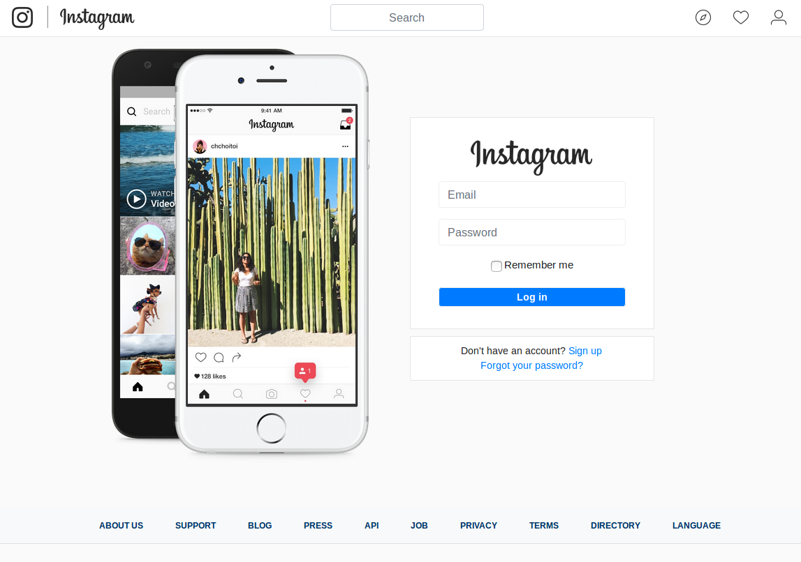

# Quicknotes_AB151-03 Christof Sy
## Lösungen der Aufgaben
#### Seite 3
- rails generate migration AddnameToUser name:string

#### Seite 4
- Da hatte ich Schwierigkeiten und fand auch nichts genaues im Netz. Ich werde dem noch nachgehen.

#### Seite 6
- CSS besitzt kein Nesting, darum haben wir wahrscheinlich die Datei im zweiten Kapitel in SCSS umgewandelt. Nesting erleichtert einem die Arbeit enorm, da man viel weniger gleicher Code schreiben muss.

#### Seite 7
- data-ride="carousel"
- active
- carousel-inner
- landing-left und landing-right
- image-url("dummy-phone-2x.png")

#### Seite 13
1. wie die (underscore)navbar im shared ordner als (underscore)footer.html.erb
2. gerendert wird sie im application.html.erb
3. <%=render 'shared/footer' %>
-
1. gleich wie footer, (underscore)dummy_phone.html.erb
2. sign in: devise session new
 sign out: devise registration new
3. <%=render 'shared/dummy_phone'%>

## Anwendungszwecke der Kapitel

### Benutzernamen erfassen
Natürlich gehört zu einem modernen Socialmedia-App einen Benutzernamen. Im vorderen Arbeitsblatt war ich etwas überrascht oder verwirrt warum man dieses Attribut nicht von Anfang an implementiert hatte und ob das noch kommen wird. In vielen Socialmedia-Apps meldet man sich hauptsächlich mit dem Benutzernamen ein, damit man einen sprechenden Namen hat für die einzelnen Benutzer.

### Dummy-phone mit Carousel-Funktion
Diese Funktion habe ich selber auch schon in einem anderen Projekt erstellt, aber nur mit SCSS und HTML5 und ohne Ruby on rails und Bootstrap. Ich finde es ist eine sehr passende und elegante Darstellungsart um ein Preview zu zeigen was man von der App erwarten kann, wenn man sich einlogged/anmeldet.

### Partial-View 'Footer' und 'Dummy-Phone'
Das Partial-View Rendering fand ich sehr gut gelöst, ich hatte in React einmal etwas ähnliches gemacht wo man quasi selber HTML-Tags erstellt und diese auch so anwendet. Das fand ich wirklich sehr interessant und praktisch.

## Selbstreflexion
Durch das Aufgaben Blatt durcharbeiten war zumteil etwas mühsam, es ist mehr eine Anleitung wie man den Auftrag genau machen muss, aber dann hat es Lücken, wo man nur selber einen kurzen Besuch bei Google machen muss, um die Anleitung zu vervollständigen. Dabei bekam ich Schwierigkeiten und Unsicherheit zu den rails-Befehlen, denn ich wusste nie, ob der Befehl mir jetzt alles kaputt machen wird oder es reibungslos funktioniert.
Ich weiss noch nicht, was ich von Bootstrap halten soll. Zum Einten kann es viele Dinge vereinfachen, wie zum Beispiel enthält es Standard CSS-Klassen, und zum Anderen weiss ich nicht genau wie, wo und was es genau macht. Höchstwahrscheinlich muss ich mich noch etwas mehr darüber informieren.

## Fazit
Der Auftrag konnte ich fast ohne Probleme meistern, zum Teil habe ich einige Tippfehler gemacht, welche mich beinahe zur Weissglut gebracht haben. Was mich am meisten überzeugt hat sind die Partial-Views, die oder etwas ähnliches werden wir sicher auch in den weiteren Auftragsblättern verwenden, zum Beispiel bei Posts.

## Screenshots
Login-View am Ende des Auftrags:

Signup-View am Ende des Auftrags:

