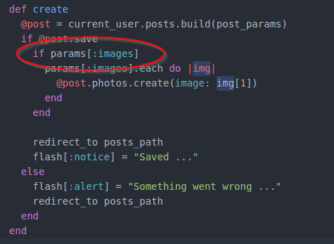
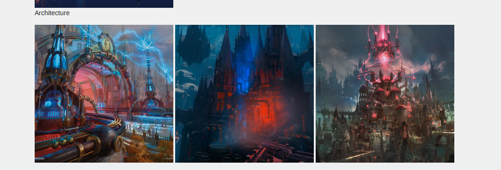
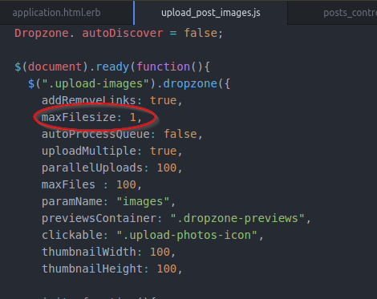
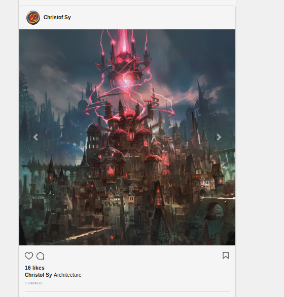
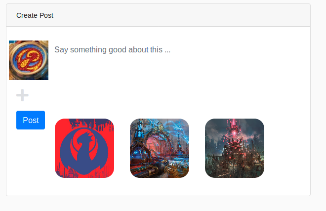
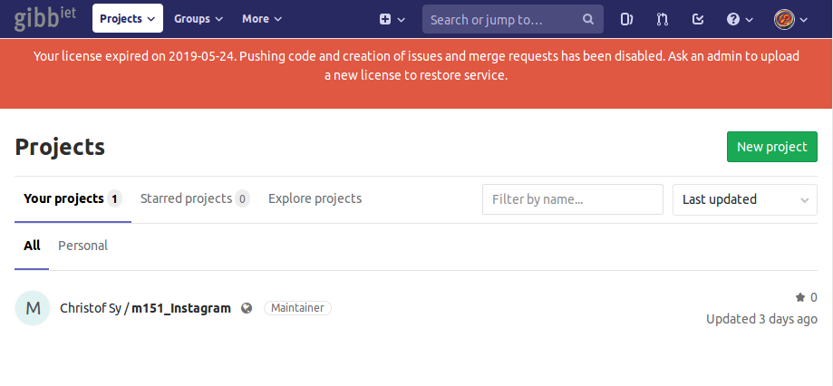
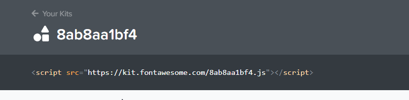

# Quicknotes_AB151-06 Christof Sy
## Lösungen der Aufgaben
### Seite 07 Post ohne Photos unterbinden

### Seite 08 Post mit Drei photos

### Seite 08 Bilspeichergrössen ändern

Dazu muss man nur die maxFilesize im upload_post_images.js ändern.

Um  die maximale upload Grösse zu ändern habe ich die umkreiste Zeile von 1 auf 3 geändern.
Das erhöht die upload Grösse von 1MB zu 3MB.

### Screenshot am Ende des Arbeitsblatts

## Anwendungszwecke der Kapitel

### Dropzone
Eine Dropzone ist ein Feld wo man per drag-and-drop Bilder einfügen oder anhänken anstelle, dass man in einer Ordnerstruktur die gewünschte Datei sucht.
Vorteile: Einfache und intuitive Bedienung
Nachteile: drag-and-drop funktioniert nur an einem PC, da man beim Smartphone keine Bilder herumziehen kann. Sobald ein Bild per drag-and-drop eingefügt wurde kann man es nicht mehr löschen, man muss also die Seite neu ladenn, wenn man ausversehen ein falsches Bild hineingezogen hat.
Durch das JavaScript upload_post_images.js haben wir später im Kapitel diese Lösch-Funktion implementiert.

## Selbstreflexion

### Was habe ich nicht verstanden? / Wo hatte ich Schwierigkeiten?
Beim Verständnis des Arbeitsblatts hatte ich keine Probleme.
Die Lizense für das Gitlab ist während der Woche abgelaufen und so musste ich auf Github umstellen.

### Was musste ich in Drittquellen nachschlagen?
Nicht direkt nachschlagen, aber der Font Awesome Skript-Tag ist nicht mehr ein Link-Tag wie in den Arbeitsblättern, sondern sieht anders aus und dadurch recherchierte ich ob diese Veränderung relevant ist. Ich fand im Internet Nichts konkretes und durch selber ausprobieren erkannte ich, dass sie nicht relevant war, ich konnte den Skript-Tag an der gleichen Stelle einfügen wie im Arbeitsblatt beschrieben.

### Was könnte ich besser machen?
Genauer den Text abschreiben. Durch einige Tippfehler in HTML-Dateien musste ich mehrmals nachschauen, wo ich den Fehler gemacht habe.

## Fazit
Die Routinearbeit war etwas mühsam, aber natürlich notwendig damit die APP vorankommt. Dieses Arbeitsblatt fand ich insgesamt nicht spannend, es wurde nichts Neues gemacht oder gezeigt. Mein Vorgang: Schlichtes Gem installiert > mühsam Code abgeschrieben.
