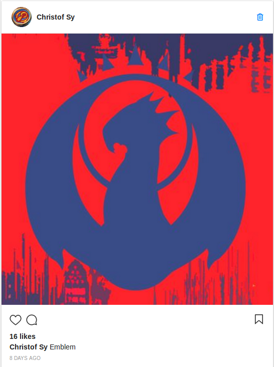
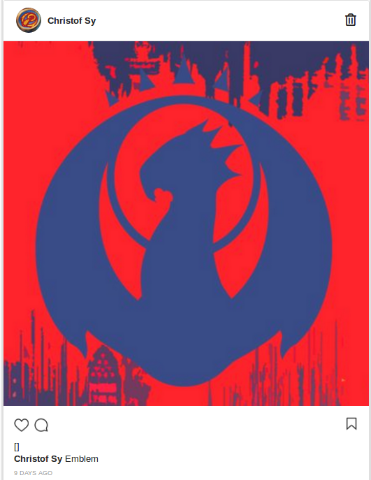
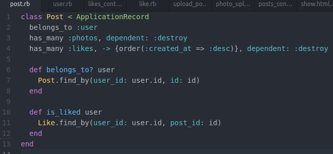
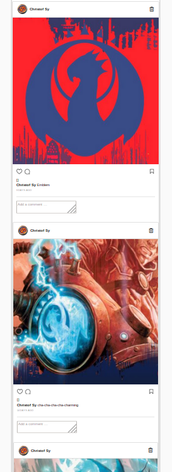
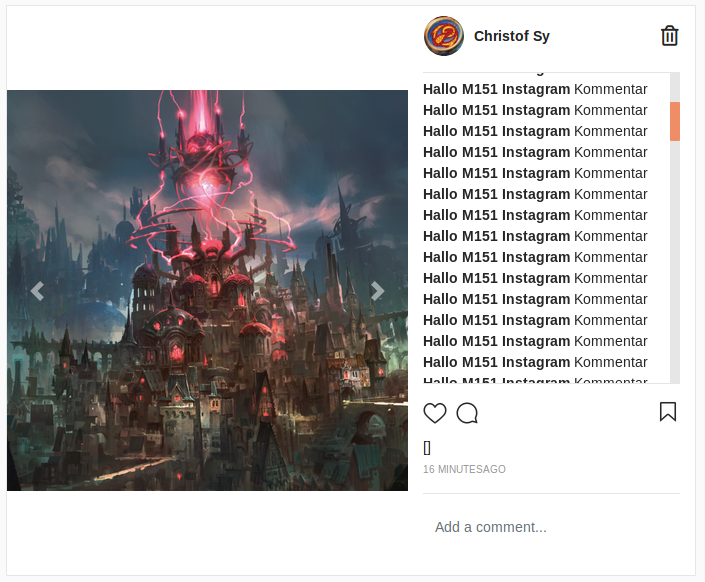

# Quicknotes_AB151-07 Christof Sy

## Zusammenfassung
### Detail Ansicht
Zur Detail Ansicht eines Post erstellte ich als erstes eine neu View im app/views/posts/ namens show.html.erb. Als erstes erstellte ich ein Gerüst aus zwei Spalten und setzte in die erste den Codeabschnitt zur Darstellung des Bildes mit den drei Knöpfen Love, Comment und Bookmark von der Partial-View \_post_list.html.erb. Danach habe ich einen Link im 'X Days AGO' hinzugefügt, der auf die Detail Ansicht des Post zeigt. Die zweite Spalte habe ich mit einigen Kommentäre gefüllt und das Stylesheet zur Kommentar-Liste angepasst.

### Post Delete
Um einen Post zu löschen muss im Post-Controller eine destroy-Methode programmieren. Am Anfang überprüfe ich noch, ob der Post den man löschen will überhaupt von dem aktuellen Benutzer erstellt wurde. Sonst könnte ja Jeder irgendwelche Posts löschen, und das würde ein Chaos geben. Jedem Post fügen wir zusätzlich noch einen Besitzer hinzu. Den Knopf zum löschen stellen wir als Mülleimer dar.

Im Stylesheet passse ich den Knopf so an, dass er nicht mehr so blau aussieht.

### Posts mit Like ergänzen
Zuerst Backend:
Für Likes habe ich ein neues Model mit Referenzen auf User und Post erstellt. Zusätzlich habe ich in der Klasse des Models definiert, dass ein User einen Post nur einmal liken kann. Im Post Model gebe ich an, dass ein Post viele Likes haben kann und schlussendlich im User Model gebe ich an, dass ein User viele Likes erfassen kann. Als nächstes erstelle ich einen Likes-Controller. Darin definiere ich eine Create und eine Destroy Methode. Im Post-Controller ergänze ich die Show- und Index-Methode mit Likes.
Als nächstes zum Frontend:
Ich setze die Like-Funktion auf den Herz Knopf. Wenn der Post von mir geliked wurde, soll das Herz rot sein, wenn nicht ist es weiss. Weil ich den Like-Knopf in zwei Stellen einbauen muss, in der Listen- und in der Detail-Ansicht, werde ich den Knopf in eine Partial-View auslagern. Zusätzlich erstelle ich einen Like-Text. Der soll beschreiben wer alles diesen Post geliked hat. Der Text wird im Format: "Name, Name, and others like this" ausgegeben. Mit zwei AJAX Dateien wird beim liken die Seite neugeladen. Den Like-Text werde ich aus dem gleichen Grund wie beim Like-Knopf auch auslagern. Wenn ich schon dabei bin kann ich noch das Photo als Partial-View auslagern.

### "InvalidForeignKey in PostsController#destroy"-Fehler
Dieser Fehler tritt auf, wenn ein geliketer Post gelöscht wird. Da die Likes einen Fremdschlüssel auf die Post Tabelle haben erzeugt das natürlich einen Fehler. Um das zu lösen habe ich im Post-Model bei Likes angegeben, dass durch das löschen eines Posts alle abhängigen Likes löscht.

## Selbstreflexion
Dieses Arbeitsblatt war wie das vorherige fast ausschliesslich mit Abschreiben gefüllt. Es war sehr frustrierend die einzelnen Abschnitte abzutippen und wenn etwas nicht funktionierte danach nach Tippfehler zu suchen. Sonst kann ich Nichts zu diesem Arbeitsblatt sagen.

## Reflexion über die gesammte APP
### Was waren die wichtigsten neuen Technologien für mich? Was habe ich gelernt?

### Wie bin ich vorgegangen beim Lernen bzw. Ausführen der Aufträge?
Da die Aufträge in einer linearen Anleitungsform geschrieben sind habe ich diese strikt Schritt für Schritt durchgearbeitet. Und wenn etwas diese Anleitung nicht genau erklärte, habe ich im Internet nachrecherchiert oder habe mich mit meinen Mitschülern ausgetauscht.

### Was waren generell die Schwierigkeiten, wie konnte ich diese lösen?
Der Anfang war für mich der schwierigste Teil. Ich hatte Schwierigkeiten mit Ruby und on Rails' Versionen. Es war sehr frustrierend und kam selber nicht zu einer Lösung darum habe ich eine Kopie der VM von einer meinen Mitschülern gemacht und konnte nach langem endlich mit den Arbeitsblätter beginnen. Dadurch dass die Vorbedingungen zum Modul nicht da waren, war das für mich sehr demotivierend.

### Funktioniert die Applikation in allen Bereichen wie gefordert?
Nicht ganz: Bei einem Post mit mehreren Bildern funktionieren die Tasten zum nächsten/vorherigen Bild nicht. Als die mehreren Bilder in einem Post in einem Arbeitsblatt, ich weiss nicht mehr genau bei welchem, eingeführt worden sind und es da schon nicht funktionierte und auch nicht erwähnt wurde, dachte ich das würde später noch implementiert werden. Aber dazu kam es nicht. Vielleicht habe ich wiedermal einen Tippfehler gemacht, aber mitlerweile ist es für mich eine Nadel im Heuhaufen Situation.

### Bin ich in gewissen Bereichen (bewusst) von der Vorgabe abgewichen? Warum?
Habe ich so gut wie nie. Wo ich abgewichen bin ist bei einigen Flash Nachrichten.

### Was mache ich bei der nächsten Rails-Applikation bzw. Web-Applikation besser oder anders?
Ich werde wohl in Zukunft nicht mehr mit Rails arbeiten aber würde ich, würde ich viel früher mich mit meinen Mitschülern austauschen. Es half mir recht viel zu sehen, dass bei einigen die gleiche Probleme auftauchen und die zusammen lösen hilft gegen die Frustration sehr.

## Lösungen der Aufgaben

### Seite 8
Sucht die Id des Users vom Post.

### Seite 9
rails generate model like post:references user:references

### Seite 12
was ist shallow: true?

### Seite 21
Dependency im Post Model ergänzen

## Screenshots

Liste mit allen Posts, mind. 2 Posts sichtbar

Detail-Ansicht eines Posts (mit mehreren Bildern)

